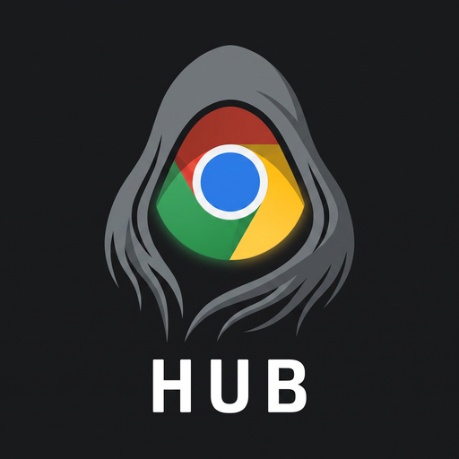

<div align="center">



# CloakBrowser Hub

**An anti-detect browser manager — profiles, fingerprints, folders and proxies.**

Windows · Linux · macOS

[Download](#download) · [Getting started](#getting-started) · [Features](#features) · [Automation](#automation) · [FAQ](#faq)

</div>

---

## What it does

Every profile is a separate identity: its own fingerprint, its own cookie jar, its own
proxy, its own folder on disk. Nothing is shared between them — and that is the whole
point. Two profiles that leak a common trait are two profiles a site can tie back to
one person.

CloakBrowser Hub manages those identities. It stores your profiles, generates
fingerprints whose parts actually fit together, groups them into folders, launches
sessions, and exposes a local API so scripts can do all of it without a single click.

---

## Download

Get the latest build from the [Releases page](../../releases). One self-contained
file — no .NET runtime, no Node, no installer.

| Platform | File |
|---|---|
| Windows x64 | `CloakBrowserHub-<version>-windows-x64.zip` |
| Linux x64 | `CloakBrowserHub-<version>-linux-x64.tar.gz` |
| macOS (Apple Silicon) | `CloakBrowserHub-<version>-macos-arm64.tar.gz` |

Each release also ships `SHA256SUMS.txt`. To confirm the download is intact:

```bash
sha256sum -c SHA256SUMS.txt
```

### Windows

Unzip and run `CloakBrowserHub.exe`.

SmartScreen will warn about an unrecognised publisher, because the build is not code
signed. Click **More info → Run anyway**.

### Linux

Needs a desktop session (X11 or Wayland).

```bash
tar -xzf CloakBrowserHub-*-linux-x64.tar.gz
chmod +x CloakBrowserHub
./CloakBrowserHub
```

### macOS

Extract the whole archive and keep the files together — the `.dylib` files next to the
executable are required, unlike on Linux where they are embedded.

```bash
tar -xzf CloakBrowserHub-*-macos-arm64.tar.gz
xattr -dr com.apple.quarantine CloakBrowserHub
chmod +x CloakBrowserHub
codesign --force --deep -s - CloakBrowserHub
./CloakBrowserHub
```

Both of the middle steps matter, for different reasons:

- **`xattr`** removes the quarantine flag. The build is not notarised, so without it
  macOS reports the app as damaged — which looks like a corrupt download but is not one.
- **`codesign -s -`** applies an ad-hoc signature. Apple Silicon refuses to execute
  *any* unsigned arm64 binary at the kernel level, and the release binary is built on
  a CI runner that does not sign it. Without this step the app is killed on launch with
  `zsh: killed` and no further explanation.

The `codesign` step needs the Xcode command line tools (`xcode-select --install`).

---

## Getting started

1. **Launch the app.** Your profiles and settings live in a folder outside the app, so
   you can move or replace the binary without losing anything.
2. **Point it at a browser.** In **Settings → Browser binary**, select your
   CloakBrowser executable.
3. **Create a profile.** Click **New profile**. A coherent fingerprint is generated for
   you — re-roll it any time from the Fingerprint tab.
4. **Add a proxy** *(optional).* On the Proxy tab, enter host, port and credentials,
   then hit **Check** to confirm it works and see the exit IP the site will observe.
5. **Launch it.** Press the play button on the profile row.

Already have profiles elsewhere? Go to **Import** — the app scans the machine for
installed Chrome, Edge, Brave and Firefox profiles, or you can point it at a copied
folder or an archive.

---

## Features

### Coherent fingerprints

A fingerprint is only convincing when its parts co-occur in the real world. A machine
claiming macOS with an `ANGLE (NVIDIA, ... D3D11)` renderer describes a computer that
cannot exist, and that single contradiction identifies you *more* than honest values
would have.

So values are drawn per platform and never mixed:

- **GPU vendor and renderer are stored as pairs** — "Apple Inc." can never appear with
  a Radeon renderer.
- **Screen sizes are per-OS** — Apple has never shipped a 1366×768 panel.
- **Locale and timezone are offered together** — `de-DE` in `Asia/Tokyo` is a
  contradiction any site can test for in one line of JavaScript.
- **`deviceMemory` is powers of two only**, the entire set the API is allowed to report.

The distributions are deliberately lumpy rather than uniform. 1920×1080 appears three
times in the Windows pool because it genuinely is that common. Picking uniformly from
a list of plausible values produces a population that is itself implausible — a profile
holding a 1-in-9 screen size stands out more, not less.

### Folders

Group profiles in a sidebar with live counts. Rename in place with Enter, right-click
for rename and delete, and move any profile with the **Move to** submenu.

**Deleting a folder never deletes the profiles in it** — they move back to the root.
A profile is real work: an aged identity with cookies and history. Losing several of
them to one misclick on a grouping label would be indefensible.

### Proxies

HTTP and SOCKS, with or without credentials, assigned per profile. The **Check** button
confirms the proxy actually works and reports the exit IP, so you can see what a site
will see before you launch.

### Import

- **Installed browsers** — Chrome, Edge, Brave, Chromium and Firefox are discovered
  automatically.
- **A copied folder** — point at a `User Data` tree from another machine.
- **Archives** — `.zip`, `.tar`, `.tar.gz` and `.tgz`.
- **Cookies only** — bring cookies into an existing profile without touching the rest.

Cookies are found in both the legacy location and the modern `Network/Cookies` one, so
profiles from older and newer Chrome versions both import cleanly.

### Cookies

Import and export from any profile's Cookies tab. Optionally save cookies
automatically when a session closes.

### Numbered taskbar icons

Every running session gets a numbered icon, so twelve open windows stay tellable apart
— a real `.ico` on Windows, `.icns` on macOS, X11 icons on Linux.

### Your data stays yours

- **Atomic saves.** Data is written to a temp file and then renamed, so a crash
  mid-save leaves the previous file intact rather than a truncated one.
- **Corrupt files are quarantined, never overwritten.** If the profile file cannot be
  read it is moved aside and the app opens with a message naming it. An empty list is
  indistinguishable from the app having thrown your work away, so it tells you where
  the bytes went.
- **One bad profile does not hide the rest.** It is skipped and reported; everything
  else loads.

---

## Automation

Drive the Hub from a script: list profiles, start one, get a CDP endpoint, attach
Puppeteer, Playwright or Selenium, then stop the session. This is what makes bulk
account work, scheduled checks and scraping under a stable identity possible.

Enable it in **Settings → Automation**. A token is generated for you.

| Request | Does |
|---|---|
| `GET /health` | Check the API is up |
| `GET /profiles` | List profiles |
| `POST /profiles` | Create a profile |
| `GET /profiles/{id}` | Fetch one profile |
| `PATCH /profiles/{id}` | Update a profile |
| `DELETE /profiles/{id}` | Delete a profile |
| `POST /profiles/{id}/start` | Start a session |
| `POST /profiles/{id}/stop` | Stop a session |
| `GET /profiles/{id}/endpoint` | Get the CDP endpoint |

```bash
curl -H "Authorization: Bearer $TOKEN" http://127.0.0.1:7317/profiles
```

```js
// Puppeteer
const { wsEndpoint } = await fetch(
  `http://127.0.0.1:7317/profiles/${id}/start`,
  { method: 'POST', headers: { Authorization: `Bearer ${token}` } },
).then(r => r.json());

const browser = await puppeteer.connect({ browserWSEndpoint: wsEndpoint });
```

`start` returns `wsEndpoint`, `httpEndpoint`, `port`, `profileId`, `profileName` and
`alreadyRunning`. Calling it on a profile that is already running is not an error — you
get the same endpoint back with `alreadyRunning: true`, so retrying after a client
timeout is safe.

**How the API is kept safe.** It hands out CDP URLs, which allow full control of a page
and access to its cookies. So:

- it **listens on loopback only** — there is deliberately no setting to change the host;
- **every request needs the token**, compared in constant time. JavaScript on any page
  you visit can reach `127.0.0.1`, so "it's only local" is not a boundary by itself;
- it **refuses to start enabled without a token** rather than quietly inventing one;
- **no CORS header is ever sent**, so a web page cannot read a reply even if it guesses
  the port.

Keep the token private. Anyone who has it can drive your profiles.

---

## Where your data lives

| OS | Path |
|---|---|
| Windows | `%APPDATA%\CloakBrowserHub\` |
| macOS | `~/Library/Application Support/CloakBrowserHub/` |
| Linux | `~/.config/CloakBrowserHub/` |

Profiles and folders are in `profiles.json`, preferences in `settings.json`. Browser
data sits in a `profiles/` subfolder, which you can relocate in Settings.

To back up everything, copy that folder. To move to another machine, copy it across.

---

## FAQ

**Does this make me undetectable?**
No, and nothing does. A determined site can tell that values are being spoofed at all.
The goal here is to stop *correlation* between your own profiles — a much more
achievable and far more useful property.

**Do MAC address and device name change my fingerprint?**
No. No web API exposes them — not `navigator`, not WebRTC, not WebGL. They change what
the *local network* sees. They are here because other tools offer them and people
reasonably ask, and the UI says so on screen rather than implying a benefit.

**Why is there one noise setting behind four switches?**
The CloakBrowser binary currently exposes a single noise switch covering canvas, WebGL,
audio and client rects together. The four values are stored separately so your settings
survive a future binary that separates them — but today, asking for noise on one
surface enables it on all four.

**Can I run many profiles at once?**
Yes. The limit depends on your licence tier and is shown in the sidebar.

**Does deleting a folder delete its profiles?**
No. They move back to the root.

**Windows says the publisher is unrecognised. macOS says the app is damaged.**
Both builds are unsigned. On Windows choose *More info → Run anyway*; on macOS run the
`xattr` and `codesign` commands in the [download section](#macos). Signing and
notarisation need paid developer certificates.

**macOS just says `killed` and exits immediately.**
That is Apple Silicon refusing an unsigned arm64 binary, and it happens before any of
the app's own code runs — so there is nothing in the logs. Run the
`codesign --force --deep -s - CloakBrowserHub` step from the
[download section](#macos) and launch again.

---

## Building from source

Requires the [.NET 8 SDK](https://dotnet.microsoft.com/download/dotnet/8.0).

```bash
git clone https://github.com/evelaa123/Cloakbrowser-Hub.git
cd Cloakbrowser-Hub/dotnet
dotnet run --project src/CloakHub.App
```

---

## License

MIT.
